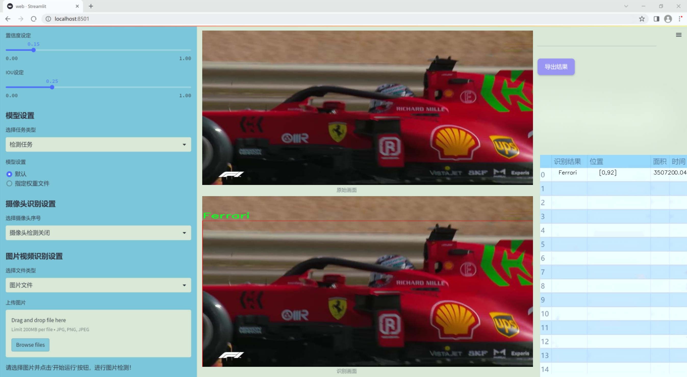
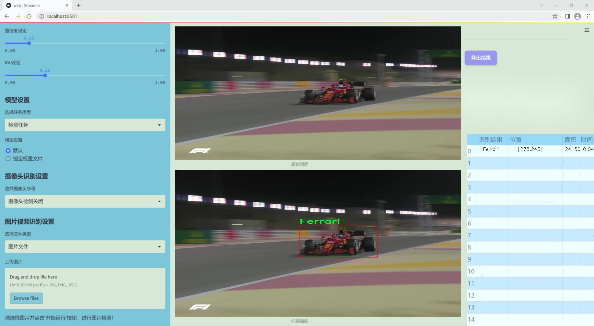
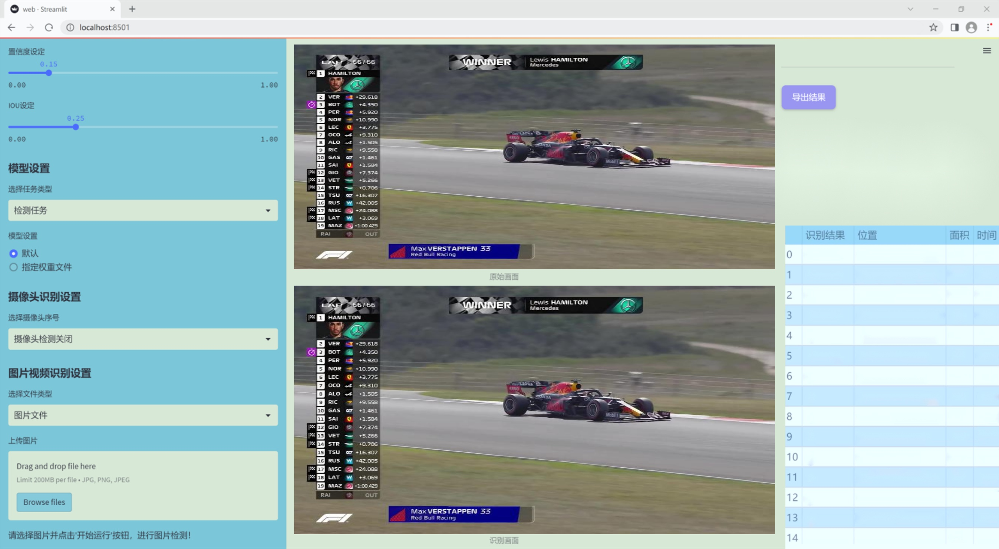
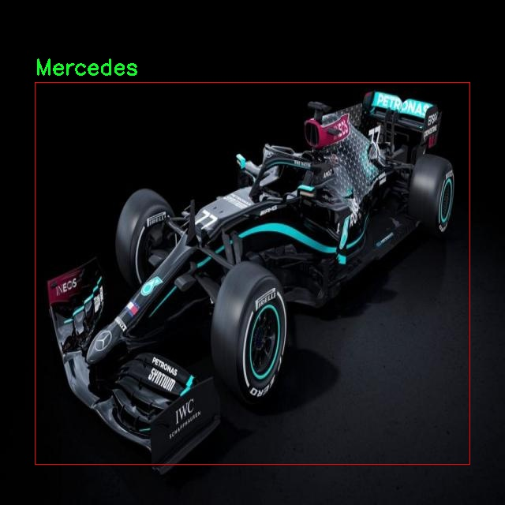
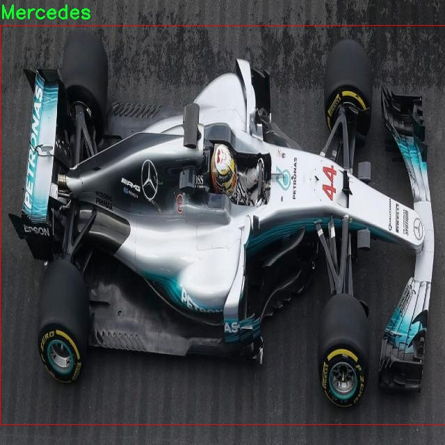
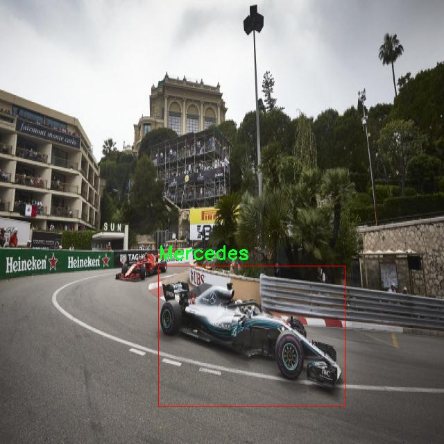

# 改进yolo11-ODConv等200+全套创新点大全：F1赛车检测系统源码＆数据集全套

### 1.图片效果展示







##### 项目来源 **[人工智能促进会 2024.10.24](https://kdocs.cn/l/cszuIiCKVNis)**

注意：由于项目一直在更新迭代，上面“1.图片效果展示”和“2.视频效果展示”展示的系统图片或者视频可能为老版本，新版本在老版本的基础上升级如下：（实际效果以升级的新版本为准）

  （1）适配了YOLOV11的“目标检测”模型和“实例分割”模型，通过加载相应的权重（.pt）文件即可自适应加载模型。

  （2）支持“图片识别”、“视频识别”、“摄像头实时识别”三种识别模式。

  （3）支持“图片识别”、“视频识别”、“摄像头实时识别”三种识别结果保存导出，解决手动导出（容易卡顿出现爆内存）存在的问题，识别完自动保存结果并导出到tempDir中。

  （4）支持Web前端系统中的标题、背景图等自定义修改。

  另外本项目提供训练的数据集和训练教程,暂不提供权重文件（best.pt）,需要您按照教程进行训练后实现图片演示和Web前端界面演示的效果。

### 2.视频效果展示

[2.1 视频效果展示](https://www.bilibili.com/video/BV1aW1YYvEYQ/)

### 3.背景

研究背景与意义

随着汽车工业的快速发展，尤其是F1赛车的技术进步，赛车运动的观赏性和竞技性不断提升。F1赛车不仅是速度与激情的象征，更是工程技术与创新的结晶。在这一背景下，如何有效地监测和分析F1赛车的表现，成为了赛车团队和研究者关注的焦点。传统的赛车检测方法往往依赖于人工监测，效率低下且容易出现误差。因此，基于计算机视觉的自动化检测系统应运而生，成为提升赛车监测效率和准确性的关键技术。

本研究旨在基于改进的YOLOv11模型，构建一个高效的F1赛车检测系统。YOLO（You Only Look Once）系列模型以其实时性和高准确率而闻名，尤其适合于快速移动物体的检测。通过对YOLOv11的改进，结合特定的F1赛车数据集，我们希望能够实现对F1赛车的快速、准确检测。该数据集包含3300张图像，专注于四个主要赛车品牌：法拉利、迈凯伦、梅赛德斯和红牛，涵盖了不同的赛道和环境条件。这一丰富的数据集为模型的训练和验证提供了坚实的基础。

通过本项目的实施，不仅可以为F1赛车的实时监测提供技术支持，还能够为赛车团队在赛事中的策略制定提供数据依据。此外，该系统的成功应用也将为其他类型的赛车检测和智能交通系统的研究提供借鉴，推动计算机视觉技术在汽车领域的进一步发展。因此，本研究具有重要的理论意义和实际应用价值，能够为F1赛车运动的科学化管理和技术创新贡献力量。

### 4.数据集信息展示

##### 4.1 本项目数据集详细数据（类别数＆类别名）

nc: 4
names: ['Ferrari', 'Mclaren', 'Mercedes', 'Redbull']


该项目为【目标检测】数据集，请在【训练教程和Web端加载模型教程（第三步）】这一步的时候按照【目标检测】部分的教程来训练

##### 4.2 本项目数据集信息介绍

本项目数据集信息介绍

本项目旨在改进YOLOv11的F1赛车检测系统，所使用的数据集名为“detection f1 cars”。该数据集专注于F1赛车的检测与识别，涵盖了四个主要的赛车类别，分别是Ferrari、Mclaren、Mercedes和Redbull。这些类别代表了当今F1赛事中最具代表性的车队，每个车队都有其独特的设计风格和色彩方案，这为模型的训练提供了丰富的视觉特征。

数据集的构建过程经过精心设计，确保涵盖了多种场景和条件下的赛车图像，以增强模型的泛化能力。图像来源于多个F1赛事，包括赛道上的实时拍摄、赛事回放以及车队发布的官方图片，确保了数据的多样性和真实性。此外，数据集中还包含了不同角度、不同光照条件下的赛车图像，这对于提高YOLOv11在复杂环境下的检测精度至关重要。

在标注方面，数据集采用了高质量的手动标注，确保每一辆赛车都被准确框定。通过使用精确的边界框，模型能够学习到不同赛车的特征和形状，从而在实际应用中实现高效的检测与分类。随着训练的深入，模型将能够识别出不同车队的赛车，并在比赛中实时跟踪其动态表现。

综上所述，“detection f1 cars”数据集不仅为改进YOLOv11提供了坚实的基础，也为未来在F1赛车检测领域的研究与应用奠定了重要的基础。通过对该数据集的深入分析与训练，我们期望能够实现更高效、更准确的F1赛车检测系统，为赛事分析、观众体验及车队策略提供强有力的支持。









### 5.全套项目环境部署视频教程（零基础手把手教学）

[5.1 所需软件PyCharm和Anaconda安装教程（第一步）](https://www.bilibili.com/video/BV1BoC1YCEKi/?spm_id_from=333.999.0.0&vd_source=bc9aec86d164b67a7004b996143742dc)


[5.2 安装Python虚拟环境创建和依赖库安装视频教程（第二步）](https://www.bilibili.com/video/BV1ZoC1YCEBw?spm_id_from=333.788.videopod.sections&vd_source=bc9aec86d164b67a7004b996143742dc)

### 6.改进YOLOv11训练教程和Web_UI前端加载模型教程（零基础手把手教学）

[6.1 改进YOLOv11训练教程和Web_UI前端加载模型教程（第三步）](https://www.bilibili.com/video/BV1BoC1YCEhR?spm_id_from=333.788.videopod.sections&vd_source=bc9aec86d164b67a7004b996143742dc)


按照上面的训练视频教程链接加载项目提供的数据集，运行train.py即可开始训练



     Epoch   gpu_mem       box       obj       cls    labels  img_size
     1/200     20.8G   0.01576   0.01955  0.007536        22      1280: 100%|██████████| 849/849 [14:42<00:00,  1.04s/it]
               Class     Images     Labels          P          R     mAP@.5 mAP@.5:.95: 100%|██████████| 213/213 [01:14<00:00,  2.87it/s]
                 all       3395      17314      0.994      0.957      0.0957      0.0843

     Epoch   gpu_mem       box       obj       cls    labels  img_size
     2/200     20.8G   0.01578   0.01923  0.007006        22      1280: 100%|██████████| 849/849 [14:44<00:00,  1.04s/it]
               Class     Images     Labels          P          R     mAP@.5 mAP@.5:.95: 100%|██████████| 213/213 [01:12<00:00,  2.95it/s]
                 all       3395      17314      0.996      0.956      0.0957      0.0845

     Epoch   gpu_mem       box       obj       cls    labels  img_size
     3/200     20.8G   0.01561    0.0191  0.006895        27      1280: 100%|██████████| 849/849 [10:56<00:00,  1.29it/s]
               Class     Images     Labels          P          R     mAP@.5 mAP@.5:.95: 100%|███████   | 187/213 [00:52<00:00,  4.04it/s]
                 all       3395      17314      0.996      0.957      0.0957      0.0845


###### [项目数据集下载链接](https://kdocs.cn/l/cszuIiCKVNis)

### 7.原始YOLOv11算法讲解


YOLO11 是 Ultralytics YOLO 系列的最新版本，结合了尖端的准确性、速度和效率，用于目标检测、分割、分类、定向边界框和姿态估计。与
YOLOv8 相比，它具有更少的参数和更好的结果，不难预见，YOLO11 在边缘设备上更高效、更快，将频繁出现在计算机视觉领域的最先进技术（SOTA）中。


**主要特点**

  * **增强的特征提取：**YOLO11 使用改进的主干和颈部架构来增强特征提取，以实现更精确的目标检测和复杂任务的性能。

  * **针对效率和速度优化：**精细的架构设计和优化的训练流程在保持准确性和性能之间最佳平衡的同时，提供更快的处理速度。

  * **更少的参数，更高的准确度：**YOLO11m 在 COCO 数据集上实现了比 YOLOv8m 更高的 mAP，参数减少了 22%，提高了计算效率，同时不牺牲准确度。

  * **跨环境的适应性：**YOLO11 可以无缝部署在边缘设备、云平台和配备 NVIDIA GPU 的系统上，确保最大的灵活性。

  * **支持广泛的任务范围：**YOLO11 支持各种计算机视觉任务，如目标检测、实例分割、图像分类、姿态估计和定向目标检测（OBB）。


### 8.200+种全套改进YOLOV11创新点原理讲解

#### 8.1 200+种全套改进YOLOV11创新点原理讲解大全

由于篇幅限制，每个创新点的具体原理讲解就不全部展开，具体见下列网址中的改进模块对应项目的技术原理博客网址【Blog】（创新点均为模块化搭建，原理适配YOLOv5~YOLOv11等各种版本）

[改进模块技术原理博客【Blog】网址链接](https://gitee.com/qunmasj/good)


#### 8.2 精选部分改进YOLOV11创新点原理讲解

###### 这里节选部分改进创新点展开原理讲解(完整的改进原理见上图和[改进模块技术原理博客链接](https://gitee.com/qunmasj/good)【如果此小节的图加载失败可以通过CSDN或者Github搜索该博客的标题访问原始博客，原始博客图片显示正常】


### 感受野注意力卷积（RFAConv)
#### 标准卷积操作回顾
标准的卷积操作是构造卷积神经网络的基本构件。它利用具有共享参数的滑动窗口提取特征信息，克服了全连通层构造神经网络固有的参数多、计算开销大的问题。设 X R∈C×H×W
表示输入特征图，其中C、H、W分别表示特征图的通道数、高度、宽度。为了清楚地演示卷积核的特征提取过程，我们使用 C = 1 的例子。从每个接受域滑块中提取特征信息的卷积运算可以表示为:


这里，Fi 表示计算后每个卷积滑块得到的值，Xi 表示每个滑块内对应位置的像素值，K表示卷积核，S表示卷积核中的参数个数，N表示接收域滑块的总数。可以看出，每个滑块内相同位置的 feature共享相同的参数Ki。因此，标准的卷积运算并不能捕捉到不同位置所带来的信息差异，这最终在一定程度上限制了卷积神经网络的性能。 

#### 空间注意力回顾
目前，空间注意机制是利用学习得到的注意图来突出每个特征的重要性。与前一节类似，这里以 C=1为例。突出关键特征的空间注意机制可以简单表述为:这里，Fi 表示加权运算后得到的值。xi 和Ai 表示输入特征图和学习到的注意图在不同位置的值，N为输入特征图的高和宽的乘积，表示像素值的总数。


#### 空间注意与标准卷积运算
将注意力机制整合到卷积神经网络中，可以提高卷积神经网络的性能。通过对标准卷积运算和现有空间注意机制的研究，我们认为空间注意机制有效地克服了卷积神经网络固有的参数共享的局限性。目前卷积神经网络中最常用的核大小是 1 × 1和3 × 3。在引入空间注意机制后，提取特征的卷积操作可以是 1 × 1或3 × 3卷积操作。为了直观地展示这个过程，在 1 × 1卷积运算的前面插入了空间注意机制。通过注意图对输入特征图(Re-weight“×”)进行加权运算，最后通过 1 × 1卷积运算提取接收域的滑块特征信息。整个过程可以简单地表示如下:


 这里卷积核K仅代表一个参数值。如果取A i× ki 的值作为一种新的卷积核参数，有趣的是它解决了 1×1卷积运算提取特征时的参数共享问题。然而，关于空间注意机制的传说到此结束。当空间注意机制被插入到3×3卷积运算前面时。具体情况如下:


如上所述，如果取A的值 i × ki (4)式作为一种新的卷积核参数，完全解决了大规模卷积核的参数共享问题。然而，最重要的一点是，卷积核在提取每个接受域滑块的特征时，会共享一些特征。换句话说，每个接收域滑块内都有一个重叠。仔细分析后会发现A12= a21， a13 = a22， a15 = a24……，在这种情况下，每个滑动窗口共享空间注意力地图的权重。因此，空间注意机制没有考虑整个接受域的空间特征，不能有效地解决大规模卷积核的参数共享问题。因此，空间注意机制的有效性受到限制。 

#### 创新空间注意力和标准卷积操作
该博客提出解决了现有空间注意机制的局限性，为空间处理提供了一种创新的解决方案。受RFA的启发，一系列空间注意机制被开发出来，可以进一步提高卷积神经网络的性能。RFA可以看作是一个轻量级即插即用模块，RFA设计的卷积运算(RFAConv)可以代替标准卷积来提高卷积神经网络的性能。因此，我们预测空间注意机制与标准卷积运算的结合将继续发展，并在未来带来新的突破。
接受域空间特征:为了更好地理解接受域空间特征的概念，我们将提供相关的定义。接收域空间特征是专门为卷积核设计的，并根据核大小动态生成。如图1所示，以3×3卷积核为例。在图1中，“Spatial Feature”指的是原始的Feature map。“接受域空间特征”是空间特征变换后的特征图。

 

由不重叠的滑动窗口组成。当使用 3×3卷积内核提取特征时，接收域空间特征中的每个 3×3大小窗口代表一个接收域滑块。接受域注意卷积(RFAConv):针对接受域的空间特征，我们提出了接受域注意卷积(RFA)。该方法不仅强调了接收域滑块内不同特征的重要性，而且对接收域空间特征进行了优先排序。通过该方法，完全解决了卷积核参数共享的问题。接受域空间特征是根据卷积核的大小动态生成的，因此，RFA是卷积的固定组合，不能与卷积操作的帮助分离，卷积操作同时依赖于RFA来提高性能，因此我们提出了接受场注意卷积(RFAConv)。具有3×3大小的卷积核的RFAConv整体结构如图所示。


目前，最广泛使用的接受域特征提取方法是缓慢的。经过大量的研究，我们开发了一种快速的方法，用分组卷积来代替原来的方法。具体来说，我们利用相应大小的分组卷积来动态生成基于接受域大小的展开特征。尽管与原始的无参数方法(如PyTorch提供的nn.())相比，该方法增加了一些参数，但它的速度要快得多。注意:如前一节所述，当使用 3×3卷积内核提取特征时，接收域空间特征中的每个 3×3大小窗口表示一个接收域滑块。而利用快速分组卷积提取感受野特征后，将原始特征映射为新的特征。最近的研究表明。交互信息可以提高网络性能，如[40,41,42]所示。同样，对于RFAConv来说，通过交互接受域特征信息来学习注意图可以提高网络性能。然而，与每个接收域特征交互会导致额外的计算开销，因此为了最小化计算开销和参数的数量，我们使用AvgPool来聚合每个接收域特征的全局信息。然后，使用 1×1 组卷积操作进行信息交互。最后，我们使用softmax来强调每个特征在接受域特征中的重要性。一般情况下，RFA的计算可以表示为:


这里gi×i 表示一个大小为 i×i的分组卷积，k表示卷积核的大小，Norm表示归一化，X表示输入的特征图，F由注意图 a相乘得到 rf 与转换后的接受域空间特征 Frf。与CBAM和CA不同，RFA能够为每个接受域特征生成注意图。卷积神经网络的性能受到标准卷积操作的限制，因为卷积操作依赖于共享参数，对位置变化带来的信息差异不敏感。然而，RFAConv通过强调接收域滑块中不同特征的重要性，并对接收域空间特征进行优先级排序，可以完全解决这个问题。通过RFA得到的feature map是接受域空间特征，在“Adjust Shape”后没有重叠。因此，学习到的注意图将每个接受域滑块的特征信息聚合起来。换句话说，注意力地图不再共享在每个接受域滑块。这完全弥补了现有 CA和CBAM注意机制的不足。RFA为标准卷积内核提供了显著的好处。而在调整形状后，特征的高度和宽度是 k倍，需要进行 stride = k的k × k卷积运算来提取特征信息。RFA设计的卷积运算RFAConv为卷积带来了良好的增益，对标准卷积进行了创新。
此外，我们认为现有的空间注意机制应该优先考虑接受域空间特征，以提高网络性能。众所周知，基于自注意机制的网络模型[43,44,45]取得了很大的成功，因为它解决了卷积参数共享的问题，并对远程信息进行建模。然而，自注意机制也为模型引入了显著的计算开销和复杂性。我们认为，将现有的空间注意机制的注意力引导到接受场空间特征上，可以以类似于自我注意的方式解决长期信息的参数共享和建模问题。与自我关注相比，这种方法需要的参数和计算资源少得多。答案如下:(1)将以接收场空间特征为中心的空间注意机制与卷积相结合，消除了卷积参数共享的问题。(2)现有的空间注意机制已经考虑了远程信息，可以通过全局平均池或全局最大池的方式获取全局信息，其中明确考虑了远程信息。因此，我们设计了新的 CBAM和CA模型，称为RFCBAM和RFCA，它们专注于接受域空间特征。与RFA类似，使用最终的k × k stride = k 的卷积运算来提取特征信息。这两种新的卷积方法的具体结构如图 3所示，我们称这两种新的卷积操作为 RFCBAMConv和RFCAConv。与原来的CBAM相比，我们在RFCBAM中使用SE attention来代替CAM。因为这样可以减少计算开销。此外，在RFCBAM中，通道注意和空间注意不是分开执行的。相反，它们是同时加权的，使得每个通道获得的注意力地图是不同的。


### 9.系统功能展示

图9.1.系统支持检测结果表格显示

  图9.2.系统支持置信度和IOU阈值手动调节

  图9.3.系统支持自定义加载权重文件best.pt(需要你通过步骤5中训练获得)

  图9.4.系统支持摄像头实时识别

  图9.5.系统支持图片识别

  图9.6.系统支持视频识别

  图9.7.系统支持识别结果文件自动保存

  图9.8.系统支持Excel导出检测结果数据


### 10. YOLOv11核心改进源码讲解

#### 10.1 test_selective_scan.py

以下是对代码的核心部分进行分析和详细注释的结果：

```python
import torch
import torch.nn.functional as F

def build_selective_scan_fn(selective_scan_cuda: object = None, mode="mamba_ssm", tag=None):
    """
    构建选择性扫描函数的工厂函数，返回一个自定义的 PyTorch 函数。
    
    参数:
    selective_scan_cuda: 选择性扫描的 CUDA 实现
    mode: 模式选择
    tag: 标签
    
    返回:
    selective_scan_fn: 自定义的选择性扫描函数
    """
    
    class SelectiveScanFn(torch.autograd.Function):
        @staticmethod
        def forward(ctx, u, delta, A, B, C, D=None, z=None, delta_bias=None, delta_softplus=False, return_last_state=False, nrows=1, backnrows=-1):
            """
            前向传播函数，计算选择性扫描的输出。
            
            参数:
            ctx: 上下文对象，用于保存反向传播所需的变量
            u: 输入张量
            delta: 变化率张量
            A, B, C: 权重张量
            D: 可选的偏置张量
            z: 可选的张量
            delta_bias: 可选的偏置变化率
            delta_softplus: 是否使用 softplus 激活
            return_last_state: 是否返回最后状态
            nrows: 行数
            backnrows: 反向传播的行数
            
            返回:
            out: 输出张量
            last_state: 最后状态（可选）
            """
            # 确保输入张量是连续的
            if u.stride(-1) != 1:
                u = u.contiguous()
            if delta.stride(-1) != 1:
                delta = delta.contiguous()
            if D is not None:
                D = D.contiguous()
            if B.stride(-1) != 1:
                B = B.contiguous()
            if C.stride(-1) != 1:
                C = C.contiguous()
            if z is not None and z.stride(-1) != 1:
                z = z.contiguous()

            # 处理 B 和 C 的维度
            if B.dim() == 3:
                B = rearrange(B, "b dstate l -> b 1 dstate l")
                ctx.squeeze_B = True
            if C.dim() == 3:
                C = rearrange(C, "b dstate l -> b 1 dstate l")
                ctx.squeeze_C = True

            # 确保 D 和 delta_bias 是浮点类型
            if D is not None and (D.dtype != torch.float):
                ctx._d_dtype = D.dtype
                D = D.float()
            if delta_bias is not None and (delta_bias.dtype != torch.float):
                ctx._delta_bias_dtype = delta_bias.dtype
                delta_bias = delta_bias.float()

            # 进行形状和维度的检查
            assert u.shape[1] % (B.shape[1] * nrows) == 0 
            assert nrows in [1, 2, 3, 4] 

            if backnrows > 0:
                assert u.shape[1] % (B.shape[1] * backnrows) == 0 
                assert backnrows in [1, 2, 3, 4] 
            else:
                backnrows = nrows
            ctx.backnrows = backnrows
            
            # 调用 CUDA 实现的前向函数
            out, x, *rest = selective_scan_cuda.fwd(u, delta, A, B, C, D, z, delta_bias, delta_softplus)

            ctx.delta_softplus = delta_softplus
            ctx.has_z = z is not None

            last_state = x[:, :, -1, 1::2]  # 获取最后状态
            ctx.save_for_backward(u, delta, A, B, C, D, delta_bias, x)
            return out if not return_last_state else (out, last_state)

        @staticmethod
        def backward(ctx, dout, *args):
            """
            反向传播函数，计算梯度。
            
            参数:
            ctx: 上下文对象
            dout: 输出的梯度
            
            返回:
            梯度元组
            """
            # 从上下文中恢复保存的张量
            u, delta, A, B, C, D, delta_bias, x = ctx.saved_tensors
            z = None
            
            # 确保 dout 是连续的
            if dout.stride(-1) != 1:
                dout = dout.contiguous()

            # 调用 CUDA 实现的反向函数
            du, ddelta, dA, dB, dC, dD, ddelta_bias, *rest = selective_scan_cuda.bwd(
                u, delta, A, B, C, D, z, delta_bias, dout, x, None, ctx.delta_softplus,
                False 
            )

            # 返回梯度
            return (du, ddelta, dA, dB, dC, dD if D is not None else None, None, ddelta_bias if delta_bias is not None else None)

    def selective_scan_fn(u, delta, A, B, C, D=None, z=None, delta_bias=None, delta_softplus=False, return_last_state=False, nrows=1, backnrows=-1):
        """
        封装选择性扫描函数，提供简化的接口。
        """
        outs = SelectiveScanFn.apply(u, delta, A, B, C, D, z, delta_bias, delta_softplus, return_last_state, nrows, backnrows)
        return outs

    return selective_scan_fn

# 选择性扫描函数的引用实现
def selective_scan_ref(u, delta, A, B, C, D=None, z=None, delta_bias=None, delta_softplus=False, return_last_state=False):
    """
    选择性扫描的参考实现，主要用于验证。
    """
    # 确保输入张量是浮点类型
    dtype_in = u.dtype
    u = u.float()
    delta = delta.float()
    if delta_bias is not None:
        delta = delta + delta_bias[..., None].float()
    if delta_softplus:
        delta = F.softplus(delta)

    # 初始化状态
    batch, dim, dstate = u.shape[0], A.shape[0], A.shape[1]
    x = A.new_zeros((batch, dim, dstate))
    ys = []

    # 计算 deltaA
    deltaA = torch.exp(torch.einsum('bdl,dn->bdln', delta, A))

    # 进行选择性扫描
    for i in range(u.shape[2]):
        x = deltaA[:, :, i] * x + deltaB_u[:, :, i]
        y = torch.einsum('bdn,dn->bd', x, C)
        ys.append(y)

    y = torch.stack(ys, dim=2)  # 堆叠输出
    out = y if D is None else y + u * rearrange(D, "d -> d 1")
    return out if not return_last_state else (out, last_state)

# 选择性扫描函数的调用示例
selective_scan_fn = build_selective_scan_fn(selective_scan_cuda, mode="mamba_ssm")
```

### 代码核心部分分析：
1. **选择性扫描函数构建**：`build_selective_scan_fn` 函数负责创建一个自定义的选择性扫描函数，该函数可以根据不同的模式调用不同的 CUDA 实现。
2. **前向传播**：`SelectiveScanFn` 类中的 `forward` 方法实现了选择性扫描的前向计算，支持多种输入格式和参数。
3. **反向传播**：`backward` 方法实现了梯度计算，确保可以通过 PyTorch 的自动微分机制进行训练。
4. **参考实现**：`selective_scan_ref` 提供了一个参考实现，用于验证自定义实现的正确性。

### 注释说明：
- 每个函数和方法都有详细的注释，说明其参数、返回值及其功能。
- 代码中的关键操作（如张量的维度处理、连续性检查等）都有相应的注释，以帮助理解其目的和作用。

这个文件 `test_selective_scan.py` 是一个用于测试选择性扫描（Selective Scan）功能的 Python 脚本，主要依赖于 PyTorch 库。该脚本包含了选择性扫描的实现、参考实现以及相应的单元测试。选择性扫描是一种在序列数据中进行累积计算的技术，广泛应用于深度学习模型中，尤其是在处理时间序列或序列数据时。

首先，脚本导入了必要的库，包括 `torch` 和 `pytest`，并定义了一些常量和函数。`build_selective_scan_fn` 函数用于构建选择性扫描的前向和反向传播功能，使用了 PyTorch 的自定义自动求导功能。这个函数接受一个 CUDA 实现的选择性扫描函数作为参数，并根据不同的模式（如 `mamba_ssm`、`ssoflex` 等）来执行不同的操作。

在 `SelectiveScanFn` 类中，定义了 `forward` 和 `backward` 静态方法。`forward` 方法实现了选择性扫描的前向传播逻辑，接收多个输入参数，包括输入张量 `u`、`delta`、`A`、`B`、`C` 等，并根据不同的模式调用相应的 CUDA 实现。它还处理了一些输入的维度和数据类型的检查，并保存必要的中间结果以供反向传播使用。`backward` 方法则实现了反向传播的逻辑，计算梯度并返回。

接下来，脚本定义了两个参考实现 `selective_scan_ref` 和 `selective_scan_ref_v2`，这些实现用于在没有 CUDA 加速的情况下验证选择性扫描的结果。这些函数的输入和输出与主函数相同，但它们使用标准的 PyTorch 操作来计算结果。

在脚本的最后部分，使用 `pytest` 框架定义了一个测试函数 `test_selective_scan`，该函数通过多种参数组合来测试选择性扫描的实现。它使用 `@pytest.mark.parametrize` 装饰器来生成不同的测试用例，包括不同的数据类型、序列长度、是否使用偏置等。测试函数中，首先生成随机输入数据，然后调用选择性扫描函数和参考实现，比较它们的输出是否相近，确保实现的正确性。

总的来说，这个文件通过定义选择性扫描的前向和反向传播功能，以及相应的测试用例，确保了该功能在不同情况下的正确性和有效性。通过使用 PyTorch 的自定义功能和 CUDA 加速，脚本能够高效地处理大规模数据，适用于深度学习模型的训练和推理。

#### 10.2 rep_block.py

以下是经过简化并添加详细中文注释的核心代码部分：

```python
import torch
import torch.nn as nn
import torch.nn.functional as F

# 定义一个用于卷积和批归一化的组合层
def conv_bn(in_channels, out_channels, kernel_size, stride=1, padding=0, dilation=1, groups=1):
    # 创建卷积层
    conv_layer = nn.Conv2d(in_channels=in_channels, out_channels=out_channels, kernel_size=kernel_size,
                           stride=stride, padding=padding, dilation=dilation, groups=groups,
                           bias=False)
    # 创建批归一化层
    bn_layer = nn.BatchNorm2d(num_features=out_channels, affine=True)
    # 将卷积层和批归一化层组合成一个顺序容器
    return nn.Sequential(conv_layer, bn_layer)

# 定义一个具有多分支结构的卷积块
class DiverseBranchBlock(nn.Module):
    def __init__(self, in_channels, out_channels, kernel_size, stride=1, padding=None, dilation=1, groups=1):
        super(DiverseBranchBlock, self).__init__()

        # 如果没有指定填充，则根据卷积核大小自动计算填充
        if padding is None:
            padding = kernel_size // 2  # 假设为奇数卷积核，填充为一半的大小

        # 定义原始卷积和批归一化层
        self.dbb_origin = conv_bn(in_channels, out_channels, kernel_size, stride, padding, dilation, groups)

        # 定义平均池化分支
        self.dbb_avg = nn.Sequential(
            nn.Conv2d(in_channels, out_channels, kernel_size=1, stride=1, padding=0, groups=groups, bias=False),
            nn.BatchNorm2d(out_channels),
            nn.AvgPool2d(kernel_size=kernel_size, stride=stride, padding=0)
        )

        # 定义1x1卷积分支
        self.dbb_1x1_kxk = nn.Sequential(
            nn.Conv2d(in_channels, out_channels, kernel_size=1, stride=1, padding=0, groups=groups, bias=False),
            nn.BatchNorm2d(out_channels)
        )

    def forward(self, inputs):
        # 前向传播
        out = self.dbb_origin(inputs)  # 通过原始卷积块
        out += self.dbb_avg(inputs)     # 加上平均池化分支的输出
        out += self.dbb_1x1_kxk(inputs) # 加上1x1卷积分支的输出
        return out  # 返回最终输出

# 测试DiverseBranchBlock
if __name__ == "__main__":
    # 创建一个DiverseBranchBlock实例
    block = DiverseBranchBlock(in_channels=3, out_channels=16, kernel_size=3)
    # 创建一个随机输入张量
    input_tensor = torch.randn(1, 3, 32, 32)  # Batch size 1, 3 channels, 32x32 image
    # 通过DiverseBranchBlock进行前向传播
    output = block(input_tensor)
    print(output.shape)  # 输出形状
```

### 代码注释说明：
1. **conv_bn函数**：创建一个包含卷积层和批归一化层的组合层，方便后续使用。
2. **DiverseBranchBlock类**：定义了一个多分支卷积块，包含原始卷积、平均池化和1x1卷积分支。
3. **__init__方法**：初始化各个分支的卷积层和批归一化层，设置填充。
4. **forward方法**：实现前向传播逻辑，将输入数据通过各个分支进行处理并相加，返回最终输出。
5. **测试代码**：创建一个DiverseBranchBlock实例，并通过随机输入张量进行测试，输出结果的形状。

这个程序文件 `rep_block.py` 定义了一些用于构建深度学习模型的模块，主要是各种类型的卷积块。这些卷积块设计用于处理图像数据，通常在卷积神经网络（CNN）中使用。文件中包含多个类和函数，每个类和函数都有其特定的功能。

首先，文件导入了必要的库，包括 `torch` 和 `torch.nn`，这些是 PyTorch 框架的核心组件。接着，定义了一些工具函数，如 `transI_fusebn`、`transII_addbranch` 等，这些函数用于处理卷积核和偏置的转换，尤其是在与批归一化（Batch Normalization）结合时的操作。

`IdentityBasedConv1x1` 类实现了一个带有身份映射的 1x1 卷积层。它的构造函数中初始化了卷积层和身份映射的权重，并在前向传播中计算卷积结果。这个类的设计使得在卷积操作中可以保留输入特征。

`BNAndPadLayer` 类则实现了一个结合了批归一化和填充的层。它在前向传播中先进行批归一化，然后根据需要对输出进行填充，确保输出的形状符合要求。

`DiverseBranchBlock` 类是一个复杂的卷积块，包含多个分支。它的构造函数中根据输入参数初始化了多个子模块，包括常规卷积、平均池化和 1x1 卷积等。这个类的设计允许在不同的分支中使用不同的卷积操作，从而实现更丰富的特征提取。

`DiverseBranchBlockNOAct` 类是 `DiverseBranchBlock` 的一个变体，不包含非线性激活函数，适用于某些特定的应用场景。

`DeepDiverseBranchBlock` 和 `WideDiverseBranchBlock` 类是进一步扩展的卷积块，分别在深度和宽度上进行增强。它们的设计与 `DiverseBranchBlock` 类似，但增加了更多的卷积层和处理方式，以适应更复杂的模型需求。

这些类的共同特点是它们都提供了 `switch_to_deploy` 方法，用于在模型部署时将训练阶段的结构转换为更高效的推理结构，减少计算开销。

总体来说，这个文件的目的是为构建深度学习模型提供灵活且高效的卷积模块，适用于各种图像处理任务。通过组合不同的卷积操作和归一化策略，这些模块能够提取丰富的特征，提升模型的性能。

#### 10.3 kacn_conv.py

以下是经过简化并添加详细中文注释的核心代码部分：

```python
import torch
import torch.nn as nn

class KACNConvNDLayer(nn.Module):
    def __init__(self, conv_class, norm_class, input_dim, output_dim, degree, kernel_size,
                 groups=1, padding=0, stride=1, dilation=1,
                 ndim: int = 2, dropout=0.0):
        super(KACNConvNDLayer, self).__init__()
        
        # 初始化输入和输出维度、卷积参数等
        self.inputdim = input_dim
        self.outdim = output_dim
        self.degree = degree
        self.kernel_size = kernel_size
        self.padding = padding
        self.stride = stride
        self.dilation = dilation
        self.groups = groups
        self.ndim = ndim
        
        # 初始化dropout层
        self.dropout = None
        if dropout > 0:
            if ndim == 1:
                self.dropout = nn.Dropout1d(p=dropout)
            elif ndim == 2:
                self.dropout = nn.Dropout2d(p=dropout)
            elif ndim == 3:
                self.dropout = nn.Dropout3d(p=dropout)

        # 验证groups参数的有效性
        if groups <= 0:
            raise ValueError('groups must be a positive integer')
        if input_dim % groups != 0:
            raise ValueError('input_dim must be divisible by groups')
        if output_dim % groups != 0:
            raise ValueError('output_dim must be divisible by groups')

        # 为每个组创建归一化层
        self.layer_norm = nn.ModuleList([norm_class(output_dim // groups) for _ in range(groups)])

        # 创建多项式卷积层
        self.poly_conv = nn.ModuleList([conv_class((degree + 1) * input_dim // groups,
                                                   output_dim // groups,
                                                   kernel_size,
                                                   stride,
                                                   padding,
                                                   dilation,
                                                   groups=1,
                                                   bias=False) for _ in range(groups)])
        
        # 注册一个缓冲区，用于存储范围值
        arange_buffer_size = (1, 1, -1,) + tuple(1 for _ in range(ndim))
        self.register_buffer("arange", torch.arange(0, degree + 1, 1).view(*arange_buffer_size))
        
        # 使用Kaiming均匀分布初始化卷积层的权重
        for conv_layer in self.poly_conv:
            nn.init.normal_(conv_layer.weight, mean=0.0, std=1 / (input_dim * (degree + 1) * kernel_size ** ndim))

    def forward_kacn(self, x, group_index):
        # 前向传播函数，处理每个组的输入
        x = torch.tanh(x)  # 应用tanh激活函数
        x = x.acos().unsqueeze(2)  # 计算反余弦并增加维度
        x = (x * self.arange).flatten(1, 2)  # 乘以范围值并展平
        x = x.cos()  # 计算余弦
        x = self.poly_conv[group_index](x)  # 通过对应的卷积层
        x = self.layer_norm[group_index](x)  # 归一化
        if self.dropout is not None:
            x = self.dropout(x)  # 应用dropout
        return x

    def forward(self, x):
        # 前向传播，处理所有组的输入
        split_x = torch.split(x, self.inputdim // self.groups, dim=1)  # 按组分割输入
        output = []
        for group_ind, _x in enumerate(split_x):
            y = self.forward_kacn(_x.clone(), group_ind)  # 处理每个组
            output.append(y.clone())  # 保存输出
        y = torch.cat(output, dim=1)  # 合并所有组的输出
        return y
```

### 代码说明：
1. **KACNConvNDLayer**: 这是一个自定义的卷积层类，支持多维卷积（1D、2D、3D）。它可以根据输入的维度和其他参数创建相应的卷积和归一化层。
2. **初始化方法**: 在构造函数中，设置了输入输出维度、卷积参数、dropout等，并对参数进行有效性检查。
3. **前向传播**: `forward_kacn`方法处理每个组的输入，通过激活函数、卷积和归一化等步骤进行处理。`forward`方法则处理所有组的输入并将结果合并。
4. **权重初始化**: 使用Kaiming均匀分布初始化卷积层的权重，以便更好地开始训练。

这个程序文件定义了一个名为 `kacn_conv.py` 的 PyTorch 模块，主要用于实现一种特殊的卷积层，称为 KACN（K-阶激活卷积网络）。该模块的核心是 `KACNConvNDLayer` 类，它是一个通用的多维卷积层，支持 1D、2D 和 3D 卷积操作。以下是对代码的详细讲解。

首先，导入了 PyTorch 的核心库和神经网络模块。接着，定义了 `KACNConvNDLayer` 类，它继承自 `nn.Module`。在构造函数 `__init__` 中，接收多个参数，包括卷积层的类型、归一化层的类型、输入和输出维度、卷积核大小、分组数、填充、步幅、扩张、维度数量以及 dropout 概率等。

在构造函数中，首先初始化了一些基本参数，并检查了分组数的有效性。接着，创建了一个模块列表 `layer_norm`，用于存储每个分组的归一化层。然后，创建了一个多项式卷积层的模块列表 `poly_conv`，该层的输入通道数是输入维度与分组数的比值乘以多项式的阶数加一，输出通道数是输出维度与分组数的比值。

接下来，使用 `register_buffer` 方法注册了一个名为 `arange` 的缓冲区，用于存储从 0 到多项式阶数的范围。最后，通过 Kaiming 正态分布初始化卷积层的权重，以便在训练开始时有更好的表现。

`forward_kacn` 方法实现了 KACN 的前向传播过程。首先对输入进行双曲正切激活，然后进行反余弦变换，并将结果与 `arange` 进行逐元素相乘，最后通过余弦函数进行变换。经过这些处理后，数据通过对应的卷积层和归一化层，并在必要时应用 dropout。

`forward` 方法则是实现了整个层的前向传播。它将输入张量按照分组进行切分，然后对每个分组调用 `forward_kacn` 方法进行处理，最后将所有分组的输出拼接在一起，形成最终的输出。

接下来，定义了三个具体的卷积层类：`KACNConv3DLayer`、`KACNConv2DLayer` 和 `KACNConv1DLayer`，分别对应 3D、2D 和 1D 卷积。它们的构造函数调用了 `KACNConvNDLayer` 的构造函数，并传入相应的卷积和归一化层类型。

总的来说，这个程序文件实现了一种灵活的 KACN 卷积层，支持多种维度的卷积操作，并且通过多项式卷积和归一化层的组合，增强了模型的表达能力。

#### 10.4 cfpt.py

以下是保留的核心代码部分，并附上详细的中文注释：

```python
import torch
import torch.nn as nn
import torch.nn.functional as F

class CrossLayerPosEmbedding3D(nn.Module):
    def __init__(self, num_heads=4, window_size=(5, 3, 1), spatial=True):
        super(CrossLayerPosEmbedding3D, self).__init__()
        self.spatial = spatial  # 是否使用空间位置嵌入
        self.num_heads = num_heads  # 注意力头的数量
        self.layer_num = len(window_size)  # 层数
        # 初始化相对位置偏置表
        self.relative_position_bias_table = nn.Parameter(
            torch.zeros((2 * window_size[0] - 1) * (2 * window_size[0] - 1), num_heads)
        )
        # 计算相对位置索引
        self.register_buffer("relative_position_index", self.calculate_relative_position_index(window_size))

    def calculate_relative_position_index(self, window_size):
        # 计算相对位置索引的逻辑
        coords_h = [torch.arange(ws) - ws // 2 for ws in window_size]
        coords_w = [torch.arange(ws) - ws // 2 for ws in window_size]
        # 生成相对坐标
        relative_coords = self.generate_relative_coords(coords_h, coords_w, window_size)
        return relative_coords.sum(-1)

    def generate_relative_coords(self, coords_h, coords_w, window_size):
        # 生成相对坐标的逻辑
        coords = [torch.stack(torch.meshgrid([coord_h, coord_w])) for coord_h, coord_w in zip(coords_h, coords_w)]
        coords_flatten = torch.cat([torch.flatten(coord, 1) for coord in coords], dim=-1)
        relative_coords = coords_flatten[:, :, None] - coords_flatten[:, None, :]
        relative_coords = relative_coords.permute(1, 2, 0).contiguous()
        relative_coords[:, :, 0] += window_size[0] - 1
        relative_coords[:, :, 1] += window_size[0] - 1
        return relative_coords

    def forward(self):
        # 前向传播，计算位置嵌入
        pos_indicies = self.relative_position_index.view(-1)
        pos_indicies_floor = torch.floor(pos_indicies).long()
        pos_indicies_ceil = torch.ceil(pos_indicies).long()
        value_floor = self.relative_position_bias_table[pos_indicies_floor]
        value_ceil = self.relative_position_bias_table[pos_indicies_ceil]
        weights_ceil = pos_indicies - pos_indicies_floor.float()
        weights_floor = 1.0 - weights_ceil

        pos_embed = weights_floor.unsqueeze(-1) * value_floor + weights_ceil.unsqueeze(-1) * value_ceil
        return pos_embed.reshape(1, 1, -1, -1, self.num_heads).permute(0, 4, 1, 2, 3)

class CrossLayerSpatialAttention(nn.Module):
    def __init__(self, in_dim, layer_num=3, num_heads=4):
        super(CrossLayerSpatialAttention, self).__init__()
        self.num_heads = num_heads  # 注意力头的数量
        self.layer_num = layer_num  # 层数
        self.cpe = nn.ModuleList([ConvPosEnc(dim=in_dim, k=3) for _ in range(layer_num)])  # 卷积位置编码
        self.qkv = nn.ModuleList(nn.Conv2d(in_dim, in_dim * 3, kernel_size=1) for _ in range(layer_num))  # QKV 线性变换
        self.softmax = nn.Softmax(dim=-1)  # Softmax 层
        self.pos_embed = CrossLayerPosEmbedding3D(num_heads=num_heads)  # 位置嵌入

    def forward(self, x_list):
        q_list, k_list, v_list = [], [], []
        for i, x in enumerate(x_list):
            qkv = self.qkv[i](x)  # 计算 QKV
            q, k, v = qkv.chunk(3, dim=1)  # 分割 QKV
            q_list.append(q)
            k_list.append(k)
            v_list.append(v)

        # 计算注意力
        attn = F.normalize(q_list[-1], dim=-1) @ F.normalize(k_list[-1], dim=-1).transpose(-1, -2)
        attn = attn + self.pos_embed()  # 加入位置嵌入
        attn = self.softmax(attn)  # 归一化

        # 计算输出
        out = attn @ v_list[-1]
        return out

class ConvPosEnc(nn.Module):
    def __init__(self, dim, k=3):
        super(ConvPosEnc, self).__init__()
        self.proj = nn.Conv2d(dim, dim, kernel_size=k, padding=k // 2, groups=dim)  # 深度卷积
        self.activation = nn.GELU()  # 激活函数

    def forward(self, x):
        return x + self.activation(self.proj(x))  # 残差连接
```

### 代码说明：
1. **CrossLayerPosEmbedding3D**：该类用于计算3D位置嵌入，包括相对位置偏置的初始化和计算。
2. **CrossLayerSpatialAttention**：该类实现了跨层空间注意力机制，使用QKV分离和位置嵌入来计算注意力。
3. **ConvPosEnc**：该类实现了卷积位置编码，使用深度卷积和激活函数进行特征增强。

这些类和方法是实现跨层注意力机制的核心部分，负责计算注意力权重和位置嵌入。

这个程序文件 `cfpt.py` 实现了一个基于深度学习的模型，主要用于图像处理任务，特别是在多层次的注意力机制上。代码中定义了多个类和函数，构成了整个模型的结构和功能。

首先，文件导入了一些必要的库，包括 `torch`、`math`、`einops` 和 `torch.nn` 等。这些库提供了深度学习所需的基本功能和操作。

接下来，定义了一个 `LayerNormProxy` 类，它是对 `LayerNorm` 的封装，主要用于在前向传播中调整输入的维度顺序，以适应 `LayerNorm` 的要求。

`CrossLayerPosEmbedding3D` 类用于实现跨层的位置信息嵌入。该类根据输入的窗口大小和头数，计算相对位置偏置，并生成绝对位置偏置。它的前向传播方法计算位置嵌入并返回。

`ConvPosEnc` 类实现了一个卷积位置编码模块，通过卷积操作对输入进行处理，并可选择性地应用激活函数。

`DWConv` 类实现了深度可分离卷积，适用于对输入特征进行卷积操作，保持输入和输出的通道数一致。

`Mlp` 类定义了一个多层感知机结构，包含两个线性层和一个激活函数，用于对输入特征进行非线性变换。

接下来，定义了一些用于窗口划分和重构的辅助函数，如 `overlaped_window_partition` 和 `overlaped_window_reverse`，这些函数用于处理输入特征图的窗口划分和重建操作。

`CrossLayerSpatialAttention` 类实现了跨层空间注意力机制。它通过多个层次的卷积位置编码、归一化、查询-键-值计算和注意力机制，来增强特征的表示能力。该类的前向传播方法处理输入特征列表，计算注意力权重，并通过残差连接和归一化操作生成输出。

`CrossLayerChannelAttention` 类实现了跨层通道注意力机制，类似于空间注意力机制，但在通道维度上进行操作。它同样通过卷积位置编码、归一化、查询-键-值计算和注意力机制来处理输入特征。

整体而言，这个程序文件构建了一个复杂的深度学习模型，结合了空间和通道注意力机制，适用于处理图像数据。通过多层次的特征提取和注意力机制，模型能够有效地捕捉输入数据中的重要信息，从而提高下游任务的性能。

注意：由于此博客编辑较早，上面“10.YOLOv11核心改进源码讲解”中部分代码可能会优化升级，仅供参考学习，以“11.完整训练+Web前端界面+200+种全套创新点源码、数据集获取”的内容为准。

### 11.完整训练+Web前端界面+200+种全套创新点源码、数据集获取


# [下载链接：https://mbd.pub/o/bread/Zp6WmJ5w](https://mbd.pub/o/bread/Zp6WmJ5w)